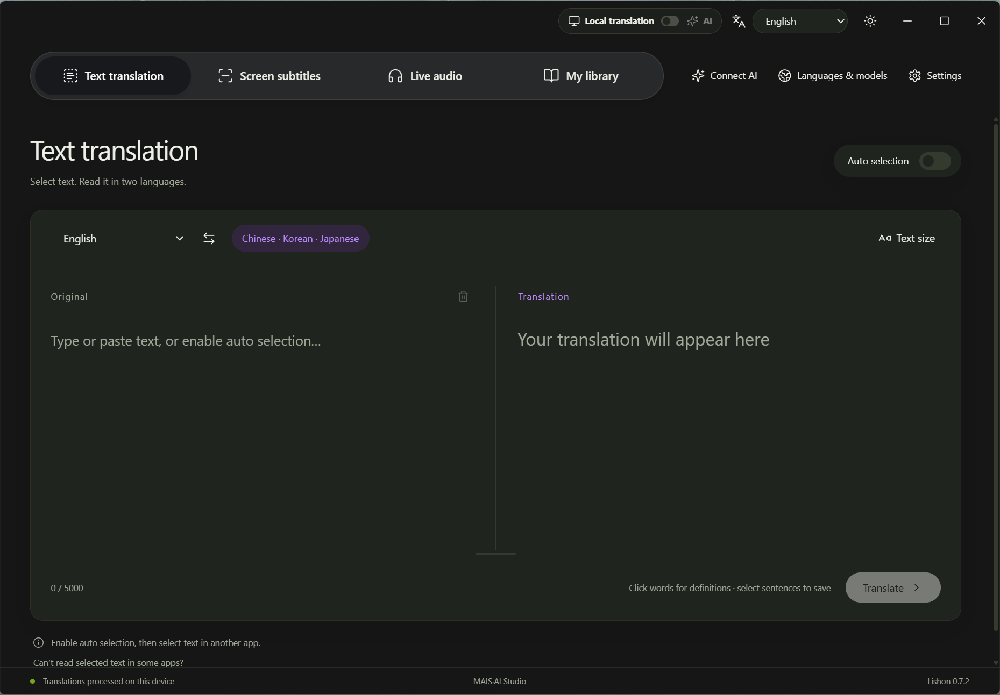
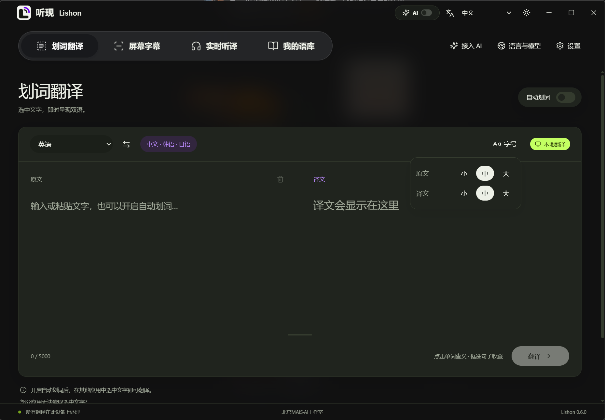
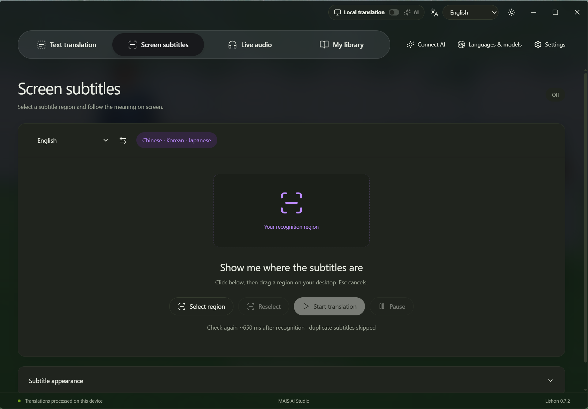
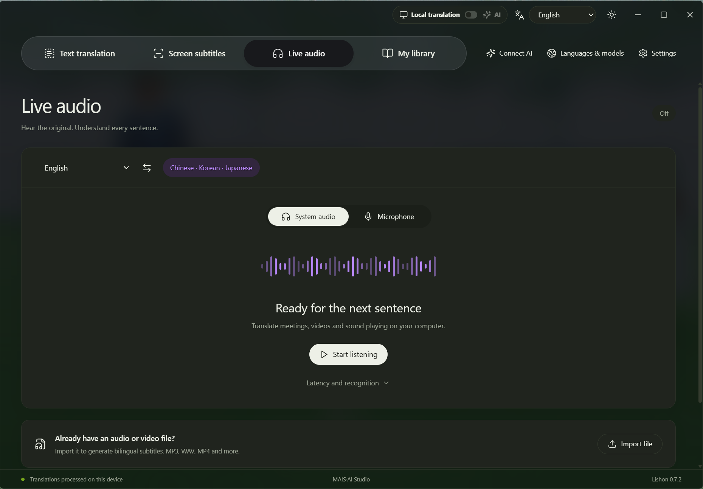
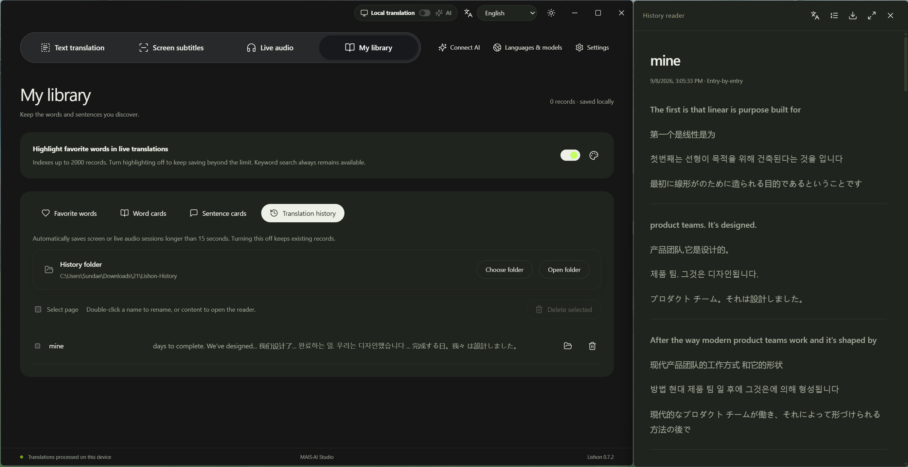
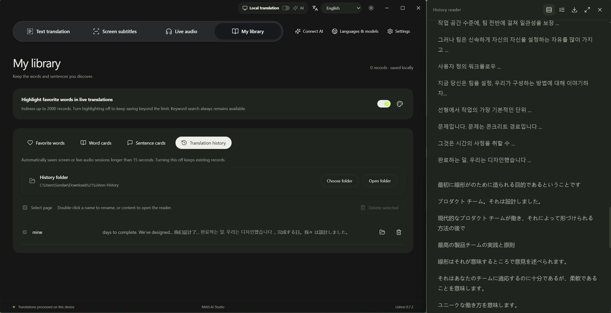
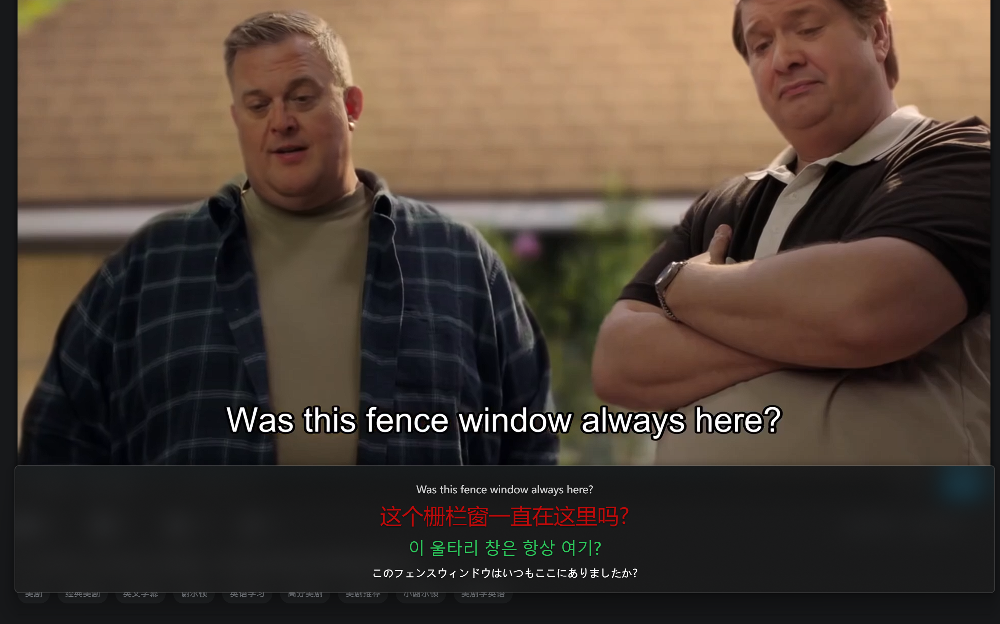

# Lishon · International Edition

**Understand the text in front of you, follow the voices around you, and keep what matters.**

Windows desktop translation · Four main workspaces · Six interface languages · Local models / Your choice of AI

**English** · [简体中文](README.zh-CN.md) | Current version: **0.7.2**





## What is Lishon?

Lishon is a Windows desktop translation application from MAIS·AI Studio. It brings text selection, screen subtitles, live audio translation, and a personal vocabulary library into one workflow.

Select text while reading foreign-language material, recognize subtitles or speech while watching a video, and save useful expressions as word or sentence cards. With history recording enabled, you can also keep a screen or audio translation session locally, then read, organize, and export it later.

Lishon is designed for reading, course study, video research, and work that involves checking translations against the original. It aims to reduce copying, window switching, and repeated dictionary lookups, so translations remain useful for learning.

## Core features

| Workspace | What you can do |
| --- | --- |
| **Text translation** | Automatically read selected text from supported applications, or paste and type manually. Editing the original triggers translation; clearing it also clears the translation. Swap languages and set independent reading sizes. |
| **Screen subtitles** | Select a region of on-screen text for continuous recognition and translation. Reselect the region, adjust its corners, pause, resume, or stop. Pausing keeps the region and current captions visible. |
| **Live audio** | Recognize system audio or the microphone and display translations as desktop captions. Import recordings and audio/video files, and export SRT subtitles. |
| **My library** | Save favorite words, word cards, and sentence cards. Search, filter by language, sort, compare translations, and delete in batches. Includes local translation history and a separate reader. |








## New: keep using your translations after the session

### Automatically save local translation history

Open **Settings → Processing & privacy**, enable history recording, and choose a storage folder. You can also set this up in **My library → Translation history**.

Screen subtitle or live audio sessions are saved after **more than 15 seconds of active running time**. Paused time does not count. Records contain the original and each target-language translation. Both AI and local-model results can be recorded; disabling recording does not delete existing records.

Scroll through the history list, double-click a name to rename it, or double-click its content preview to read it. You can reveal the file in its folder, delete one record, or delete selected records together. Deleting a record also deletes its corresponding local file.

### Read beside the app or move the panel freely

Double-click a history record to open a reader beside the main window, using the same theme. The reader shows the record title and updates it when you rename the record.

- **Entry-by-entry:** each original passage is followed by its translations, making expressions easy to check.
- **Grouped by language:** originals and translations form separate language sections for continuous reading. When numbering is shown, corresponding passages retain the same number across languages.
- **Move and dock:** drag the reader away to place it independently; bring it near the main window's right edge and release to dock it again.
- **Full-screen reading:** keep the selected layout with a centered text column and generous side margins.

This update fixes cumulative reader-window growth during movement and improves following, detaching, and docking behavior.

### Export notes in the layout you are reading

The reader's upper-right toolbar has five controls: **layout, numbering and language labels, export, full screen, and close**.

Export to **Markdown or PDF** using the current layout. Turn off **Show numbering and languages** to remove these annotations from both the reader and exported files while keeping the text. The export button retains its original icon after completion.

PDF uses white pages, black body text, and medium-gray language labels. Markdown uses inline HTML styles for gray language labels; their appearance depends on the reader's support for those styles. History saved in the earlier Markdown format remains readable.



## Make desktop captions your own

Move captions, center the text, wrap long passages automatically, and switch between translated-only and bilingual display. Width has **20 steps**, with a maximum setting of **3,840 logical pixels**; the physical screen area depends on Windows scaling. Display the latest **one to three caption groups**.

Choose fonts, text size, text color, text shadow, background color, opacity, and a frosted background effect in Settings. The background can be turned off, and colors use a fixed palette of swatches. Configure up to **three target languages**, each with its own order, text size, and color.

The application has light and dark themes and interfaces in Chinese, English, Japanese, Korean, French, and Russian. Interface language is independent of translation language.



## Switch between local models and AI

The top-bar capsule switches between **Local translation and AI**. Turning AI off keeps your saved API configuration.

The complete installer includes translation models for English in both directions with Chinese, Japanese, Korean, French, German, Spanish, and Russian: **eight languages and 14 direct translation directions**, plus **Whisper Base** speech recognition. These supported local capabilities work offline after installation, without separately downloading the bundled models.

For language pairs without a local direct model, you can use AI. The application does not automatically translate through English as an intermediate language.

Open **Connect AI**, choose a provider, and enter your own API key, endpoint, and available model. Presets include DeepSeek, Qwen, Kimi, OpenAI, Gemini, and Claude, with support for custom compatible endpoints.

The built-in translation Agent uses the original text and optional recent context to handle fixed expressions, mixed languages, and specialist terminology. Choose a real-time priority mode or a review-based quality priority mode; the latter adds latency and API usage. Results still depend on recognition quality and the selected model.

## Getting started

1. **Install:** run the complete installer and choose application and model folders. They may share a folder or use separate directories or drives.
2. **Choose a mode:** use local translation without an API, or enter and save your connection settings before enabling AI.
3. **Choose languages:** set recognition and target languages, then open Text translation, Screen subtitles, or Live audio.
4. **Keep useful content:** save words and sentences, or enable history recording to read and export a session afterward.

The **2–8 second** audio control determines how much sound is collected before processing. Shorter intervals favor responsiveness; longer ones preserve more context. Recognition, translation, and any network requests add to the total delay.

Favorite words can be highlighted in live translations, with configurable colors. Live highlighting indexes up to **2,000 records**. Turn it off to keep saving beyond that limit; keyword search remains available.

## Installation, data, and scope

- **System:** Windows 10 version 2004 or newer, or Windows 11, x64.
- **Installer:** approximately 2.06 GiB, mainly because it includes model weights. Application and model locations are customizable; see the [installation guide](docs/INSTALLATION.md).
- **Storage:** history is saved in the `Lishon-History` subfolder of your selected folder. Changing the location does not automatically move older records.
- **Uninstall:** choose separately whether to delete history and installer-inventoried models. Both options are unchecked by default, preserving your data.
- **Processing:** local mode performs recognition and translation on the device. AI mode sends the text and any enabled recent context to your chosen provider, whose API pricing applies.
- **Scope:** cross-application text selection depends on application support and permissions. Some screen-recognition languages require Windows OCR language features. Audio, image quality, and hardware affect results; zero latency and perfect accuracy are not promised.

## Source code and contributions

Original project code uses the [Apache-2.0 license](LICENSE). Models, dictionaries, and other dependencies retain their own licenses; see [third-party notices](THIRD_PARTY_NOTICES.md). Model weights and installer EXEs are not included in the Git repository.

After preparing the Windows development environment, run these commands from the project root:

```powershell
powershell -ExecutionPolicy Bypass -File scripts/restore-dev.ps1
npm run desktop
```

The setup script does not automatically download every translation model. A browser-only preview cannot perform full desktop capture. See [development documentation](docs/DEVELOPMENT.md) for requirements and testing, and read the [contribution guide](CONTRIBUTING.md) before submitting changes.

**MAIS·AI Studio** aims to make cross-language reading more continuous and turn each moment of understanding into something you can use again.
