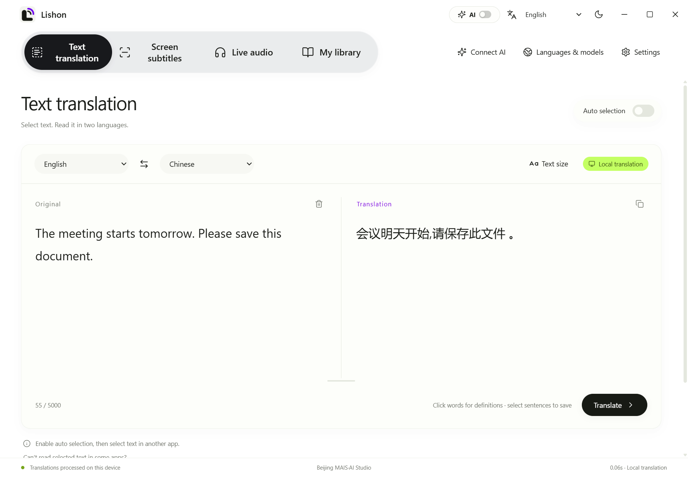
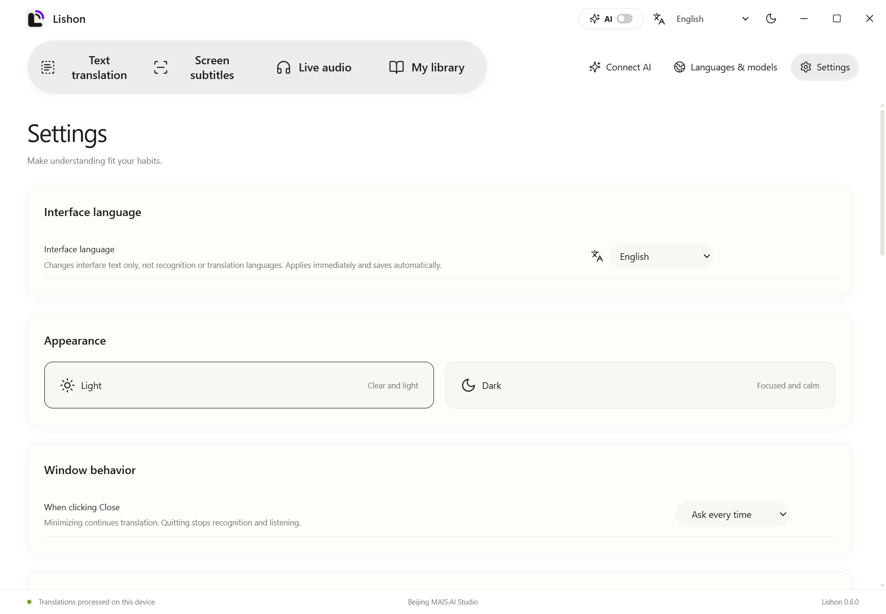
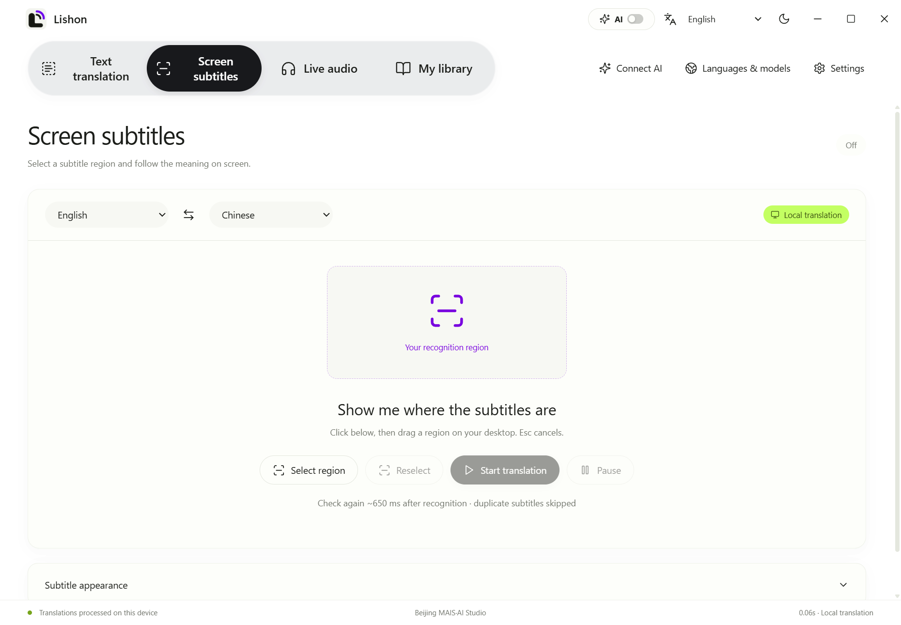
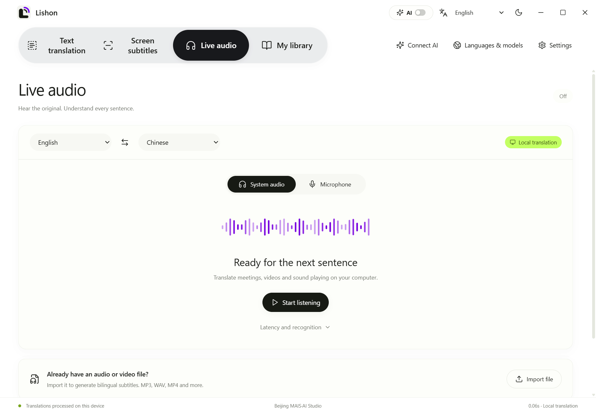
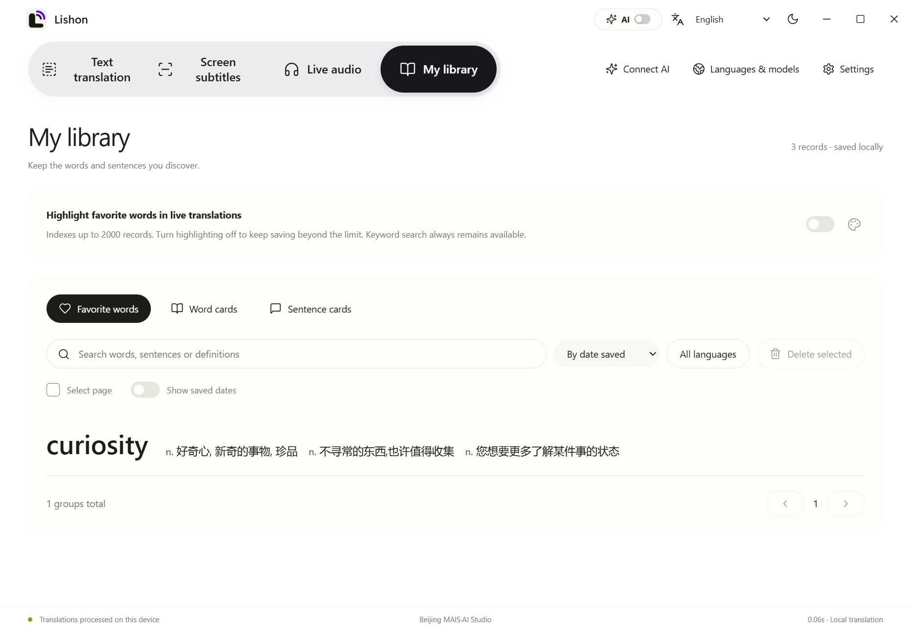
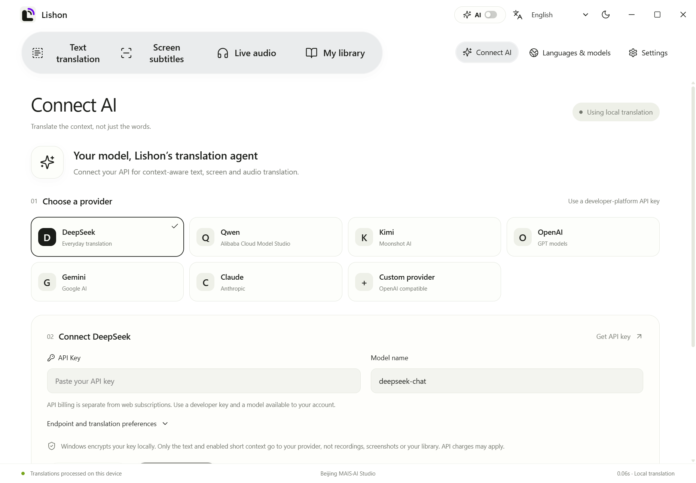

<div align="center">
  
  <h1>Lishon · 听现</h1>
  <p><strong>Read across languages. Follow the conversation.</strong></p>
  <p>Text selection, screen subtitles, live audio translation and your personal vocabulary library — on Windows.</p>
  <p><strong>English</strong> · <a href="README.zh-CN.md">简体中文</a></p>
  <p>Windows 10/11 x64 · 6 interface languages · Local models + optional AI · Apache-2.0</p>
</div>



## What is Lishon?

Lishon is a Windows desktop translation assistant from **Beijing MAIS·AI Studio**. It brings the text you select, the subtitles you see and the speech you hear into a consistent bilingual workflow. Save useful words and sentences to a local library instead of looking them up repeatedly.

Use local models for supported offline language pairs, or connect your own AI provider for context-aware translation. The top-bar AI switch lets you change modes without deleting your saved API configuration.

**This repository contains the international edition’s source code (0.6.0). It does not contain an installer or model weights.** The screenshots show the real Electron app using demonstration text and a separate local profile; no API key is shown.

## Features

| Feature | What it does |
| --- | --- |
| Text translation | Automatically reads selectable text from supported apps; supports manual editing, bilingual comparison, language swapping and independent reading sizes. |
| Screen subtitles | Recognizes a selected screen region. Resize the region, pause while keeping the current captions, resume, or stop completely. |
| Live audio | Transcribes system audio or the microphone and displays desktop captions. Import audio/video files and export bilingual SRT. |
| My library | Save favorite words, dictionary cards and sentence pairs locally. Search, filter languages, sort, compare and batch-manage records. |
| Optional AI | Bring your own API. Provider presets include DeepSeek, Qwen, Kimi, OpenAI, Gemini and Claude, plus a compatible custom endpoint. |
| Desktop captions | Rounded background, light/dark UI, text styles, background opacity and blur, movable captions, 20 width steps and up to 3 recent caption groups. |

### Six interface languages

Choose **中文, English, 日本語, 한국어, Français or Русский** using the language selector between the **AI switch** and **theme button**. The same setting is available at the top of **Settings**.

The interface updates immediately, including navigation, help text, dialogs and caption controls. Your selection is saved across restarts. **Interface language does not change the recognition language, translation direction, original text or saved cards.** Controls allow longer labels to wrap while icons keep their proportions.



### Screen translation without copying text

Open **Screen subtitles → Select region**, draw the recognition area and choose **Start translation**. Pause preserves the area and visible captions. Stop removes the area and ends recognition. The corner handles let you refine the region.



### Listen, read and keep the useful parts

Open **Live audio**, choose **System audio** or **Microphone**, then start listening. A 2–8 second control sets how much audio is collected before processing: shorter intervals favor responsiveness; longer ones preserve more context. Recognition, translation and network time add to that interval.

For existing recordings, use **Import file**. Supported formats include MP3, WAV and MP4. Completed file translations can be exported as SRT.



Click a word in the text workspace to view dictionary definitions, favorite it or create a word card. Select a sentence to save it with its translation. Live favorite-word highlighting is capped at 2,000 library records; turning highlighting off allows further saving while retaining keyword search.



### Your API, a translation-focused agent

In **Connect AI**, choose a provider and enter your own API key, base URL and available model ID. Test the connection before saving. Provider presets are editable; model availability depends on your account.

The translation agent requests direct source-to-target translation, handles mixed-language input, preserves names and numbers, and uses context for phrases and ambiguous words. **Fast** mode makes one translation request; **With review** adds a source-based review, increasing latency and API cost. Up to three target languages are supported.



## Run from source

### Requirements

- Windows 10 version 2004 or newer / Windows 11, x64.
- Node.js **22.12+** with npm, Python **3.11** managed by `uv`, and **.NET 10 SDK**.
- Internet access for the initial dependency/data setup; enough disk space for development tools and optional models.

From the repository root in PowerShell:

```powershell
powershell -ExecutionPolicy Bypass -File scripts/restore-dev.ps1
npm run desktop
```

The setup installs dependencies, prepares the dictionary, builds the Windows helper and builds the frontend. It **does not create an installer or download all translation models**. For frontend-only development:

```powershell
npm ci
npm run dev
```

The browser is a UI preview; desktop capture and local inference require Electron. After setup, `scripts/start.ps1` builds the frontend and opens the desktop app.

### Prepare models

Open **Languages & models** and choose a model storage folder. You can reuse an existing compatible model folder, download the required models, or import a compatible `.lishonpack`.

| Capability | Model requirement |
| --- | --- |
| Local text translation | Direct English ↔ Chinese, Japanese, Korean, French, German, Spanish or Russian models: 14 directions across 8 languages. |
| Other text pairs | Use AI direct translation when a local direct model is unavailable. The application does not silently pivot through English. |
| Audio recognition | Whisper Base is required even when AI translates the recognized text. |
| Screen recognition | Chinese/English RapidOCR is provided by the engine dependency. Other languages use the corresponding Windows OCR feature. |
| Dictionary | ECDICT and WordNet data are prepared by the setup script; definitions remain separate from AI translation. |

**Six interface languages and eight translation languages are separate settings.** Changing a model folder does not move or delete the old models. Large model files and generated dictionary databases are excluded from Git.

## Privacy and limitations

- Local recognition and supported local translation run on the device. AI mode sends the text and enabled short context to the chosen API provider; screenshots, recordings and the vocabulary library are not sent by the AI translation route.
- API keys are encrypted locally with Windows protection. Web subscriptions and API billing are separate.
- The international edition uses a separate `lishon-international` directory under Windows AppData. It does not overwrite the original edition’s settings or library.
- Selection capture depends on application support and permissions. Protected content, very small text, noise and rapid speech can reduce recognition quality.
- AI cannot recover content that was never recognized. Translation accuracy and latency vary with content, hardware, network and model. This is not a guarantee of simultaneous interpretation.
- Windows system file-picker buttons follow the Windows display language; Lishon supplies localized titles and file-type labels.

## Development

```powershell
npm test
npm run build
.venv\Scripts\python.exe -B -m unittest discover -s tests -p "test_*.py"
```

The internationalization regression suite checks six locales, navigation, setting synchronization, persistence, subtitle controls and layouts at 1240px and 820px. See [development and verification](docs/DEVELOPMENT.md) for the desktop test and model prerequisites.

```text
src/          React interface and caption windows
shared/       Six-language UI message catalog and formatter
electron/     Windows lifecycle, IPC, AI adapters and translation routing
native/       Selection, region handles, OCR integration and Windows materials
engine/       Local translation, speech recognition and vocabulary storage
scripts/      Development setup, dictionary preparation and build tools
tests/        Unit and desktop regression tests
docs/images/  Real Chinese and English interface screenshots
```

Contributions to translation wording, accessibility and Windows compatibility are welcome. See [CONTRIBUTING.md](CONTRIBUTING.md). Do not include personal API keys, recordings or vocabulary databases in an issue or pull request.

## License and credits

Original Lishon code is licensed under [Apache-2.0](LICENSE), as chosen by the project owner. Third-party libraries, datasets and model weights retain their own licenses; see [NOTICE](NOTICE) and [THIRD_PARTY_NOTICES.md](THIRD_PARTY_NOTICES.md).

Built by **Beijing MAIS·AI Studio** — practical tools for reading, listening and understanding across languages.
