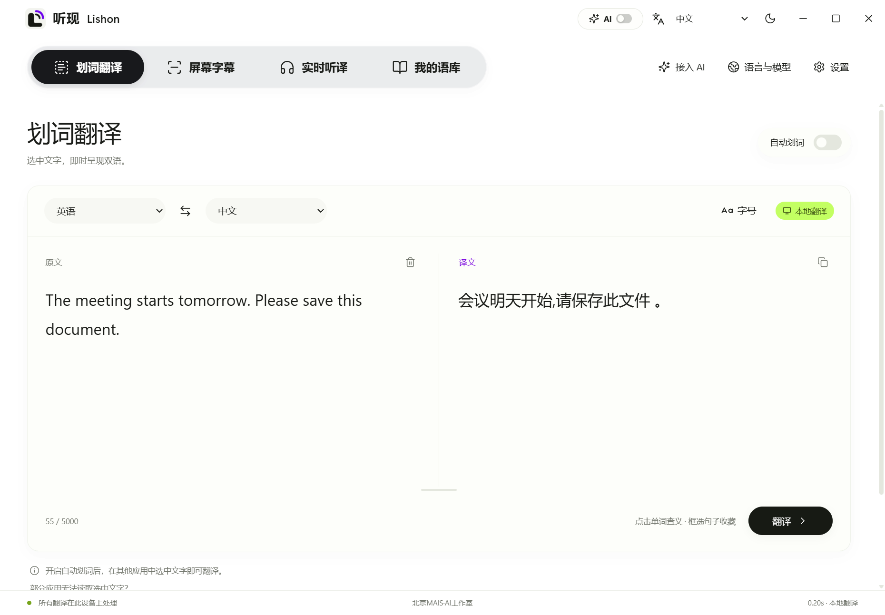
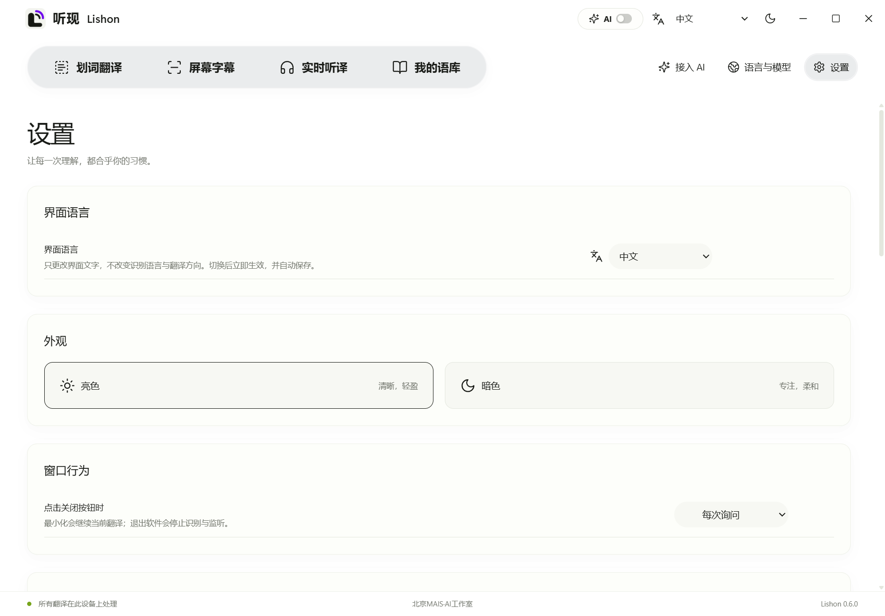
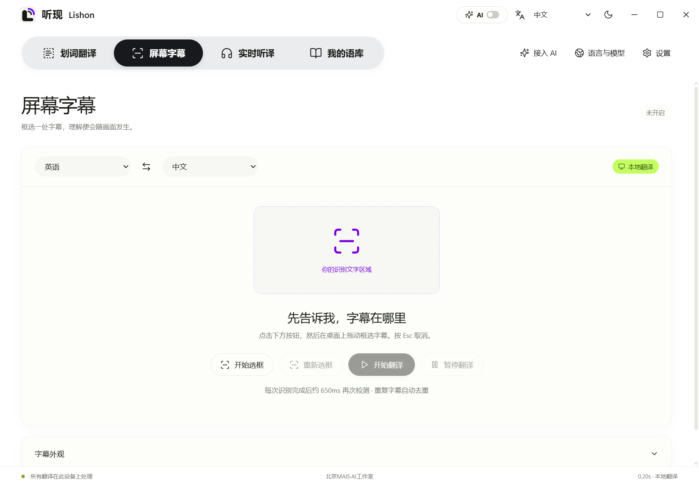
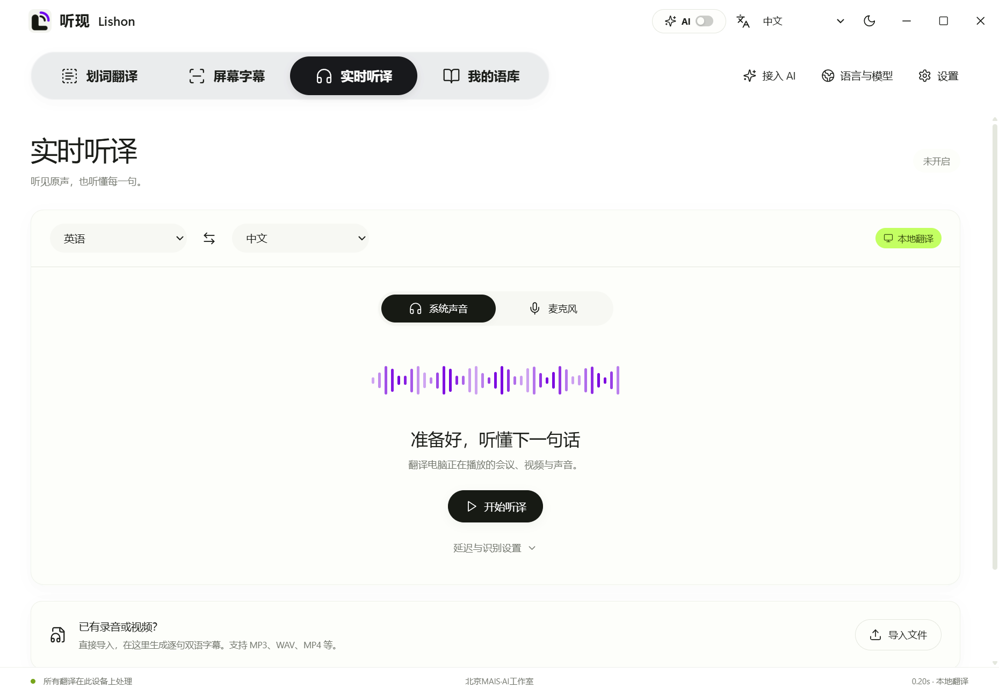
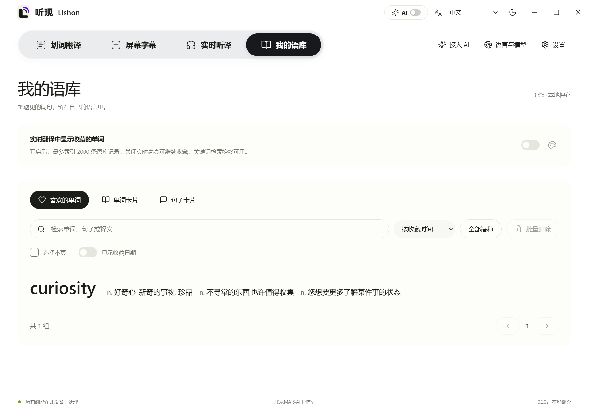
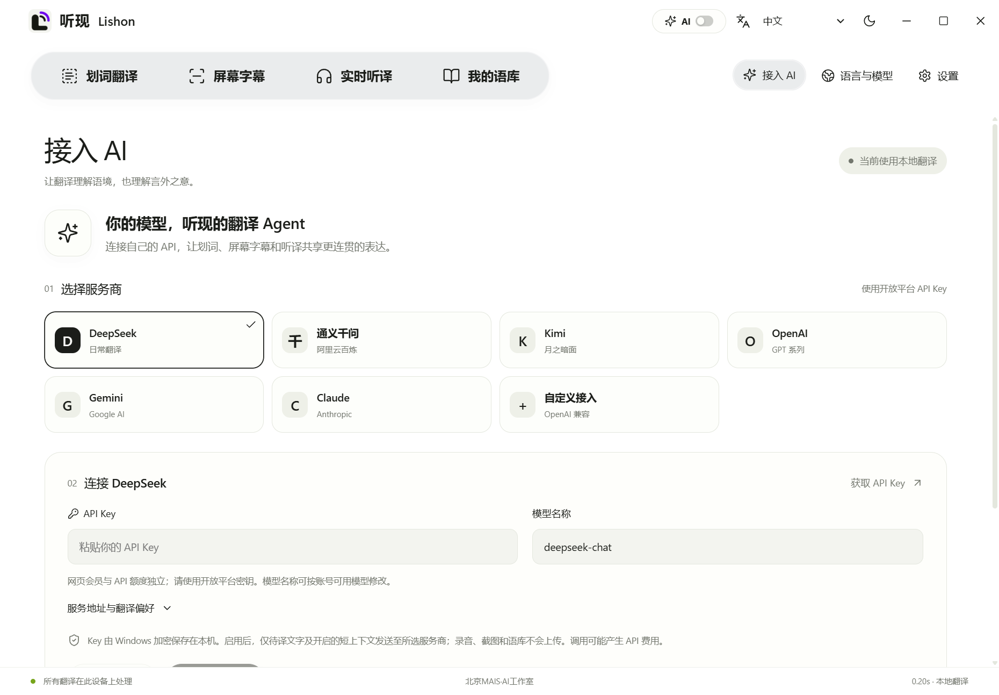

<div align="center">
  
  <h1>听现 Lishon · 国际版</h1>
  <p><strong>看懂眼前的文字，听懂耳边的声音。</strong></p>
  <p>集划词翻译、屏幕字幕、实时听译与个人语库于一体的 Windows 桌面翻译工具。</p>
  <p><a href="README.md">English</a> · <strong>简体中文</strong></p>
  <p>Windows 10/11 x64 · 六种界面语言 · 本地模型与可选 AI · Apache-2.0</p>
</div>



## 产品介绍

听现 Lishon 由 **北京 MAIS·AI 工作室**打造，面向外文阅读、视频学习、会议听译和语言积累等桌面场景。选中的文字、画面中的字幕和正在播放的声音，都可以进入同一个双语工作流程。遇到值得记住的单词与句子，还能保存到自己的语库中。

软件支持本地模型与可选 AI 翻译。已支持的语言对可以离线处理；需要更复杂的语境理解时，可以接入自己的 API。顶部 AI 开关可随时切回本地翻译，已保存的 API 配置不会被删除。

**本仓库提供国际版 0.6.0 源代码，不包含安装 EXE 与模型权重。** 以下为实际 Electron 应用截图，使用演示文本与独立配置，不包含个人密钥。

## 功能一览

| 功能 | 说明 |
| --- | --- |
| 划词翻译 | 从支持的应用中读取选中文字，也可手动编辑；原文与译文对照显示，支持语言互换、独立字号与一键清空。 |
| 屏幕字幕 | 框选屏幕文字区域进行识别与翻译；支持调整区域、暂停保留字幕、继续和完全停止。 |
| 实时听译 | 识别系统声音或麦克风，生成桌面字幕；支持音视频导入与双语 SRT 导出。 |
| 我的语库 | 本地保存喜欢的单词、单词卡片与句子卡片；支持检索、语种筛选、排序、对照与批量管理。 |
| 接入 AI | 自备 API，支持 DeepSeek、通义千问、Kimi、OpenAI、Gemini、Claude 及自定义兼容接口。 |
| 桌面字幕 | 圆角背景、亮暗界面、字号与颜色设置、透明度和磨砂；支持拖动位置、20 档宽度与最近 3 组内容。 |

## 六种界面语言，一键切换

顶部 **AI 开关与亮暗主题按钮之间**新增界面语言选项，包括：**中文、English、日本語、한국어、Français、Русский**。同样的选项位于 **设置**页面顶部，两处同步。

切换立即生效，并在下次启动时保留。导航、功能提示、应用弹窗和字幕工具栏随之切换；较长的文字可自动换行，图标保持比例。**界面语言与识别、翻译语言相互独立，不会改写原文、译文或收藏内容。**



## 使用方式

### 阅读文字：选中即可翻译

进入划词翻译，设置原文与目标语言，再开启“自动划词”。在支持读取选中文字的应用中选取内容，原文会自动带入，译文同步更新。也可直接输入或粘贴。两种语言中间的交换按钮，可以互换语言与相应内容。

### 看视频：圈出需要识别的位置

进入 **屏幕字幕 → 开始选框**，拖动选择识别区域，再点击“开始翻译”。暂停会保留选框与当前字幕；继续后恢复识别；停止则结束任务并移除选框。四角标记可用于微调识别范围。



### 听声音：边播放，边阅读

在“实时听译”中选择系统声音或麦克风，开始听译即可生成字幕。2–8 秒的调节控制每次先收集多久的声音：短一些更快响应，长一些保留更多上下文，实际等待还包括识别、翻译和网络耗时。

已有录音或视频可通过“导入文件”处理，支持 MP3、WAV、MP4 等格式，完成后可导出 SRT 字幕。



### 学到的内容，留在自己的语库

点击单词查看释义，使用桃心收藏，或添加为单词卡片；选中句子后，可将原文与译文一起保存。语库支持语种筛选和不同语言对照。实时收藏词高亮最多索引 2,000 条记录；关闭实时高亮后可继续保存，关键词检索仍可使用。



## 使用自己的 AI 提高语境理解

在“接入 AI”中选择服务商，填写自己的 API Key、服务地址与账号可用的模型名称，测试连接后保存。预设模型可以修改，是否可用取决于服务商及账号权限。

内置翻译 Agent 要求直接依据原文翻译，处理混合语种、固定短语和专业用语，并保留专名、数字与语气。实时优先执行一次翻译；精校优先增加一次对照原文的复核，会带来额外等待与 API 费用。最多可设置三种目标语言。



## 从源码运行

### 环境要求

- Windows 10 2004 及以上或 Windows 11，x64。
- Node.js **22.12+** 与 npm、由 `uv` 管理的 Python **3.11**、**.NET 10 SDK**。
- 首次准备依赖及词典需要联网，并为开发依赖和可选模型预留空间。

在项目根目录打开 PowerShell：

```powershell
powershell -ExecutionPolicy Bypass -File scripts/restore-dev.ps1
npm run desktop
```

准备脚本会安装依赖、准备词典、构建原生辅助程序和前端，**不会生成安装包，也不会自动下载全部翻译模型**。完成后，也可运行 `scripts/start.ps1` 构建前端并打开应用。

只预览界面时：

```powershell
npm ci
npm run dev
```

浏览器预览不具备桌面采集及本地推理能力，完整功能请在 Electron 桌面应用中使用。

### 模型准备

在“语言与模型”中指定模型存储目录。可选择已有的兼容模型目录、下载所需模型，或导入兼容的 `.lishonpack`。

| 能力 | 模型要求 |
| --- | --- |
| 本地文字翻译 | 英语与中、日、韩、法、德、西、俄双向互译，共 8 种语言、14 个方向。 |
| 其他翻译组合 | 缺少本地直译模型时可使用 AI 直接翻译，不会默认通过英语中转。 |
| 音频识别 | 需要 Whisper Base；即使使用 AI 翻译文字，声音仍须先由语音模型识别。 |
| 屏幕识别 | 中英 RapidOCR 来自引擎依赖；其他语种需要对应的 Windows OCR 语言功能。 |
| 词典释义 | 准备脚本获取 ECDICT 与 WordNet 并生成本地词典，独立于 AI 正文翻译。 |

六种**界面语言**与八种**翻译语言**是两项独立能力。改变模型目录不会移动、删除旧模型。模型权重和生成的词典数据库不进入 Git 仓库。

## 隐私与适用范围

- 本地识别和已支持的离线翻译在设备上执行。AI 模式将待译文字与开启的短上下文发送给所选服务商，不通过 AI 翻译通道上传录音、截图或个人语库。
- API Key 使用 Windows 保护机制加密保存。网页会员与 API 额度独立，费用由服务商决定。
- 国际版使用 AppData 下独立的 `lishon-international` 数据目录，不覆盖原中文版的设置和收藏。
- 跨应用划词取决于应用支持及权限。受保护内容、过小文字、噪声和过快语速可能影响识别。
- AI 无法保证恢复未识别的内容。翻译质量和延迟取决于内容、硬件、网络及模型，不承诺零延迟或同声传译级准确度。
- Windows 系统文件选择器自身的按钮遵循 Windows 显示语言；听现提供的窗口标题与文件类型说明使用所选界面语言。

## 开发与贡献

```powershell
npm test
npm run build
.venv\Scripts\python.exe -B -m unittest discover -s tests -p "test_*.py"
```

国际化回归覆盖六种语言、两处设置联动、持久化、字幕工具栏，以及 1240px / 820px 下的亮暗布局。完整说明见 [开发文档](docs/DEVELOPMENT.md)。

主要目录：`src/` 为界面，`shared/` 为六语文案，`electron/` 为桌面与 API 调度，`native/` 为 Windows 辅助功能，`engine/` 为本地推理与语库，`scripts/` 为准备脚本，`tests/` 为回归测试。

欢迎改进翻译文案、无障碍体验和 Windows 兼容性。提交方式见 [贡献指南](CONTRIBUTING.md)。请勿在 Issue 或代码中附上个人 API Key、录音或语库数据库。

## 许可证与工作室

听现原创代码采用项目所有者选择的 [Apache-2.0](LICENSE) 许可证。第三方依赖、词典和模型仍适用各自许可证，详见 [NOTICE](NOTICE) 与 [第三方说明](THIRD_PARTY_NOTICES.md)。

**北京 MAIS·AI 工作室**关注技术在真实工作与学习场景中的应用。听现希望减少语言切换带来的操作负担，让阅读更连贯，让理解发生在当下。
